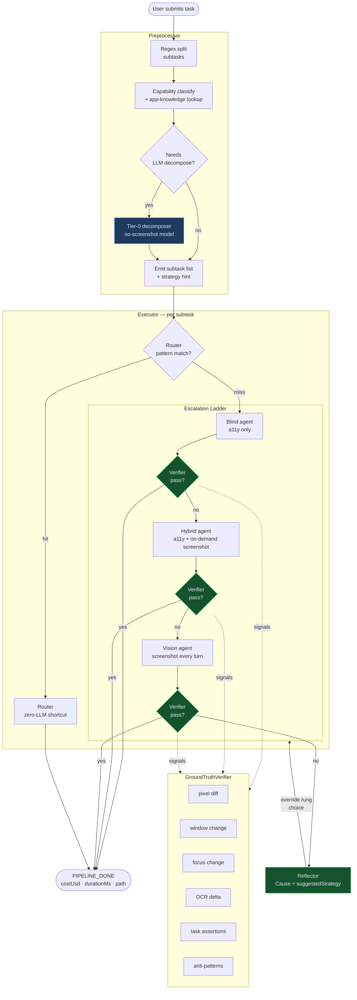
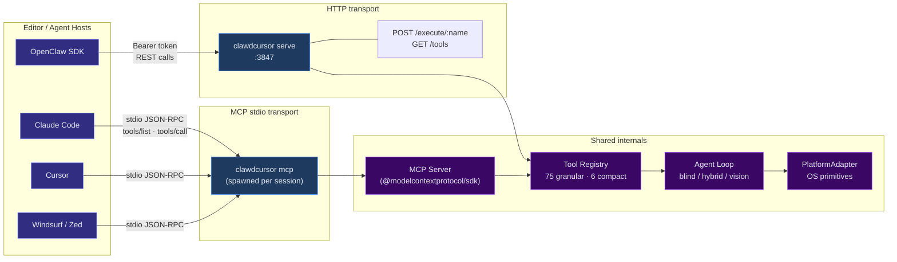

# clawdcursor v0.9 README — Building Blocks

Raw material for the v0.9 README rewrite. Contains two Mermaid diagrams and
four reference tables. Everything below is ready to drop into the final README
with light prose wrapping.

---

## 1. Autonomous Pipeline Diagram

**Node count:** 12 primary nodes + 3 verifier signal groups (collapsed).

**Key flows:**
- The preprocessor splits compound tasks with regex; an optional Tier-0 LLM
  call refines the split for ambiguous phrasing.
- Each subtask walks the escalation ladder: `router → blind → hybrid → vision`.
  The ladder stops at the first rung that passes the verifier.
- After every rung the `GroundTruthVerifier` fires 6 independent signals
  (weighted vote, no LLM self-report). A failed verdict on the vision rung
  triggers the Reflector, which emits a structured `Cause` + `suggestedStrategy`
  and loops back into the ladder with a rung override.
- On success the pipeline emits `PIPELINE_DONE` with cost, duration, and path.

---

## 2. Transport / Client-Connectivity Diagram

**How to read it:**
- The **stdio path** (`clawdcursor mcp`) is spawned as a child process by the
  editor host; communication is stdin/stdout JSON-RPC. The host owns the
  process lifecycle.
- The **HTTP path** (`clawdcursor serve`) runs as a persistent daemon on
  `:3847`. Clients discover tools via `GET /tools` and call them via
  `POST /execute/:name` with a Bearer token.
- Both paths converge on the same `Tool Registry` and the same `Agent Loop`.
  There is no feature disparity between transports.

---

## 3. Cost-Tier Table

The agent picks the cheapest tier that can read the UI. It escalates up the
ladder only when a lower tier cannot produce a reliable result.

| Tier | Name | Cost (relative) | When the agent uses it | Example tools |
|------|------|-----------------|------------------------|---------------|
| T1 | **Structured (a11y)** | ~1× | UI exposes a full accessibility tree (Win UIA, macOS AX API, Linux AT-SPI). No image tokens. | `accessibility(invoke)`, `accessibility(find)`, `accessibility(set_value)` |
| T2 | **OCR** | ~2× | A11y tree is sparse or unreliable (legacy controls, some Electron apps). Text read from pixel buffer via Tesseract. | `system(ocr)`, `smart_read`, `smart_click` |
| T3 | **Screenshot on demand** | ~4× | Agent is in `hybrid` mode — screenshot called only when a11y is ambiguous for a specific decision. | `computer(screenshot)` called inside the hybrid agent turn |
| T4 | **Vision (every turn)** | ~8–15× | Canvas apps, spatial drag tasks, image-only UIs, or after blind/hybrid fail. Screenshot prepended to every LLM call. | `computer(screenshot)` + vision model on every turn; `computer(drag_path)` |

> Cost multiples are approximate and model-dependent. T1 often costs `$0.001–0.005` per task; T4 with a premium vision model can reach `$0.02–0.10`. The blind-first default keeps most routine tasks at T1.

---

## 4. Transport Table

| | **stdio MCP** | **HTTP REST** |
|---|---|---|
| **Use case** | Editor-embedded agent (Claude Code, Cursor, Windsurf, Zed) | Standalone daemon; bring-your-own agent; scripts; CI pipelines |
| **Command** | `clawdcursor mcp` or `clawdcursor mcp --compact` | `clawdcursor serve --port 3847` |
| **Client config snippet** | `{"mcpServers":{"clawdcursor":{"command":"clawdcursor","args":["mcp","--compact"]}}}` | `POST http://127.0.0.1:3847/execute/computer` + `Authorization: Bearer <token>` |
| **Tool discovery** | MCP `tools/list` RPC | `GET http://127.0.0.1:3847/tools?mode=compact` |
| **Latency notes** | Process startup ~300 ms (once per session). Per-call overhead: ~0 ms beyond tool execution. | HTTP round-trip ~1–2 ms on localhost. Persistent process; no startup cost per call. |
| **Auth model** | No auth (localhost stdio; the OS session is the trust boundary) | Bearer token written to `~/.clawdcursor/token` at startup. GET endpoints are public; all POST endpoints require the token. |
| **Catalog sizes** | Default: 75 granular. With `--compact`: 6 compound. | Default: 75 granular (`GET /tools`). Compact: 6 compound (`GET /tools?mode=compact`). |

---

## 5. Cross-Platform Capability Matrix

| Platform | Mouse / Kbd input | A11y tree source | Screenshots | Clipboard | Browser CDP | Host-app requirement |
|---|---|---|---|---|---|---|
| **Windows** | nut-js (Win32 `SendInput`) | UIA (PowerShell bridge, preloaded at startup) | `desktopCapturer` / sharp | Win32 clipboard API | Chrome/Edge DevTools Protocol on port 9222 | None — direct Win32 APIs |
| **macOS** | nut-js mouse + System Events keyboard (TCC-safe) | macOS AX API via native Swift helper (`ClawdCursorHelper`) | `screencapture` via swift helper | `pbcopy` / `pbpaste` | Chrome DevTools Protocol on port 9222 | `ClawdCursorHost.app` in `dist/native/` (auto-started; `clawdcursor grant` sets TCC) |
| **Linux X11** | nut-js (`XTest` extension via `libX11`) | AT-SPI D-Bus bridge (`atspi-bridge.py` — requires `python3-gi` + `gir1.2-atspi-2.0`) | `scrot` / `import` / sharp | `xclip` / `xsel` | Chrome DevTools Protocol on port 9222 | None; X11 display required (`DISPLAY` env) |
| **Linux Wayland** | `ydotool` (kernel `uinput`) or `wtype` (kbd-only fallback) | AT-SPI D-Bus bridge (same as X11) | `grim` or portal screenshot | `wl-clipboard` (`wl-copy` / `wl-paste`) | Chrome DevTools Protocol on port 9222 | `ydotool` daemon (`ydotoold`) must be running; needs `uinput` group membership |

> Input and a11y availability are checked at startup via `PlatformAdapter.checkPermissions()`. The `clawdcursor doctor` command prints a per-capability readiness report.

---

## 6. Compound-Tool Catalog

The 6 compound tools mirror the Anthropic `computer_20250124` shape: one tool
per capability domain, with an `action` enum selecting the verb. Use via
`clawdcursor mcp --compact` or `GET /tools?mode=compact`.

| Tool | Purpose | Key actions | Tier | Example call |
|------|---------|-------------|------|--------------|
| `computer` | Raw mouse, keyboard, and pixel perception | `screenshot`, `click`, `double_click`, `right_click`, `scroll`, `drag`, `drag_path`, `type`, `key`, `wait` | T3–T4 (screenshot); T1 (kbd/mouse) | `computer({"action":"key","combo":"mod+s"})` |
| `accessibility` | Structured UI tree — read, find, interact | `read_tree`, `find`, `invoke`, `set_value`, `get_value`, `expand`, `toggle`, `select`, `wait_for` | T1 | `accessibility({"action":"invoke","name":"Send"})` |
| `window` | App and window lifecycle management | `list`, `active`, `focus`, `open_app`, `open_url`, `open_file`, `maximize`, `minimize`, `close`, `navigate`, `switch_tab` | T1 | `window({"action":"open_app","name":"Notepad"})` |
| `system` | Clipboard, OCR, time, shortcuts, Electron bridge | `clipboard_read`, `clipboard_write`, `ocr`, `system_time`, `shortcuts_run`, `detect_webview`, `relaunch_with_cdp`, `delegate` | T1–T2 | `system({"action":"ocr"})` |
| `browser` | Chrome/Edge DOM via DevTools Protocol | `connect`, `page_context`, `read_text`, `click`, `type`, `evaluate`, `wait_for`, `list_tabs`, `switch_tab` | T1 (DOM) | `browser({"action":"read_text","selector":"h1"})` |
| `task` | Delegate a natural-language sub-instruction to the full pipeline | *(no action enum — takes `instruction` string)* | All (pipeline decides) | `task({"instruction":"Reply to Sarah's email"})` |
